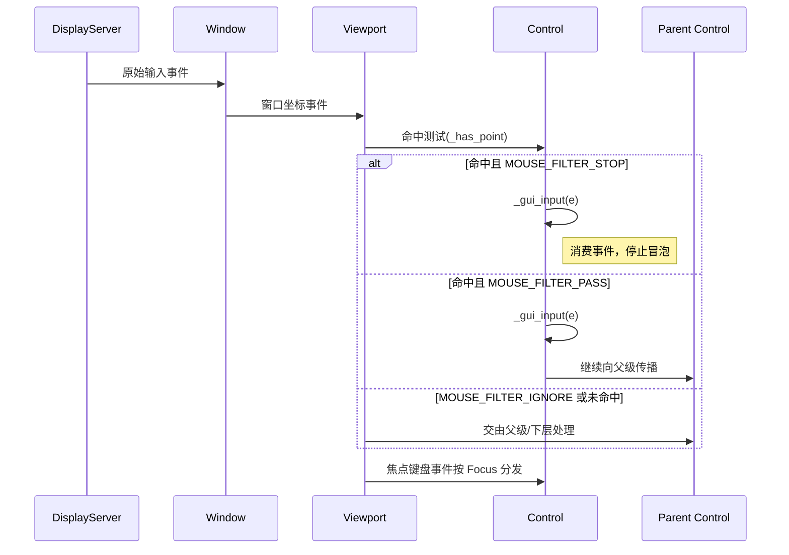
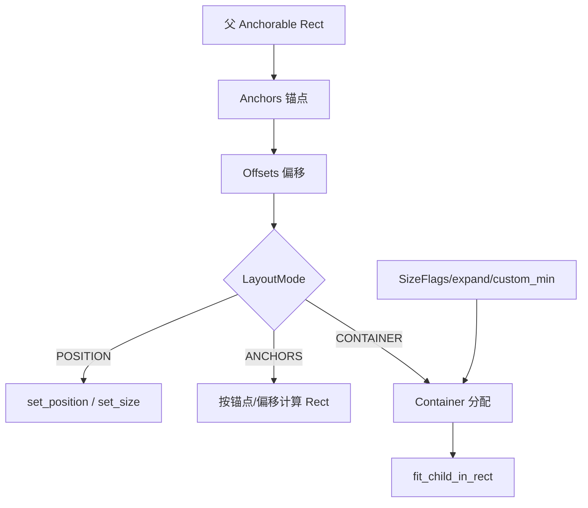
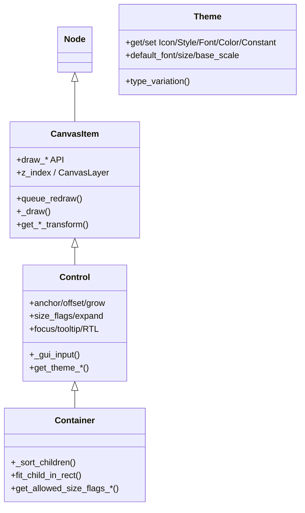

# Godot UI 架构阅读指南（TinaGodot 无 3D 版）

本文面向引擎源码阅读与二次开发，聚焦 Godot UI（Control 系统）在 2D 渲染栈上的实现方式，结合关键源码位置做导读说明。

## 总览

- 分层关系：`Node` → `CanvasItem` → `Control` → 具体控件/容器（如 `Button`/`Label`/`BoxContainer`）。
- 渲染通路：Control 继承自 CanvasItem，借助其 2D 绘制 API（draw_*）提交到 `RenderingServer`，最终在 `Viewport`/`CanvasLayer` 下合成。
- 输入通路：输入事件（鼠标/键盘/滚轮/触摸）经 `Window`/`Viewport` 命中测试后分派至 `Control::_gui_input`，受 `MouseFilter`、焦点与模态栈影响。
- 布局系统：单节点（锚点/偏移/生长方向）与容器（`Container`）并存；容器负责对子控件按规则分配矩形。
- 主题系统：`Theme` 资源提供 icon/stylebox/font/color/constant，Control 支持覆盖与缓存，存在多级回退链。

> 说明：本仓库剔除了 3D 功能，但 UI 完全工作在 2D Canvas 流程中，几乎不受影响。

## 可视化流程图

以下使用 Mermaid 语法描述关键流程与关系。若本地预览不渲染，可在 GitHub 打开或使用支持 Mermaid 的 Markdown 预览插件。

### 渲染流程（从重绘请求到屏幕合成）

```mermaid
flowchart TD
    EV[queue_redraw/属性变化] -->|下一帧| ND[CanvasItem NOTIFICATION_DRAW]
    ND --> DRA[_draw()]
    DRA --> API{{draw_* 调用}}
    API --> RS[RenderingServer 命令队列]
    RS --> CL[CanvasLayer/Canvas]
    CL --> VP[Viewport]
    VP --> OUT[屏幕合成]

    subgraph 顺序控制
      ZI[z_index / z_relative]
      LY[CanvasLayer]
    end
    API -. 受影响 .-> ZI
    API -. 受影响 .-> LY
```

要点：`queue_redraw()` 触发下一帧 `NOTIFICATION_DRAW`，在 `_draw()` 中调用 `draw_*` API，指令进入 `RenderingServer`，按 `CanvasLayer` 与 `z_index` 合成到屏幕。

### 输入事件分发（命中测试与鼠标过滤）



说明：鼠标命中由 `_has_point()` 判定；`MouseFilter` 决定事件是否拦截或透传；键盘/手柄输入遵循焦点分发（可结合邻接导航）。

### 布局决策流程（单节点与容器）



要点：单节点通过 `anchor/offset/grow` 得到最终 Rect；容器通过 `_sort_children()` 与子项最小尺寸和 `SizeFlags/expand` 进行空间分配，并调用 `fit_child_in_rect()`。

### 主题查找与回退链

```mermaid
flowchart LR
    REQ[请求 get_theme_* (name,type)] --> OV[控件覆盖]
    OV -- miss --> OWN[ThemeOwner/Control.theme]
    OWN -- miss --> PARENT[父控件/窗口]
    PARENT -- miss --> PROJ[项目默认主题]
    PROJ -- miss --> ENG[引擎默认主题]
    ENG --> HIT[返回命中项]

    subgraph 变体
      VARI[Type Variation: FlatButton->Button]
    end
    REQ -. 类型解析 .-> VARI
```

要点：Control 会对各级查找结果做缓存；类型变体（variation）允许在类型层面建立继承/回退。

### 类关系与职责



## 关键类与文件

- `scene/main/canvas_item.h`：2D 可绘制节点基类，提供绘制 API、可见性、Z 顺序与 2D 变换。
  - 参考：`scene/main/canvas_item.h:1`，`scene/main/canvas_item.h:120`（DRAWING API），`scene/main/canvas_item.h:180`（变换）。
- `scene/gui/control.h`：所有 UI 控件基类，布局/输入/焦点/主题/本地化等的核心入口。
  - 参考：`scene/gui/control.h:1`，`scene/gui/control.h:40`（中文导读），`scene/gui/control.h:200`（Data 布局缓存与状态），`scene/gui/control.h:280`（输入/鼠标过滤），`scene/gui/control.h:320`（焦点），`scene/gui/control.h:340`（主题）。
- `scene/gui/container.h`：容器基类，负责触发与实现对子控件的自动布局。
  - 参考：`scene/gui/container.h:42`（中文导读），`scene/gui/container.h:68`（fit_child_in_rect）。
- `scene/resources/theme.h`：主题资源，提供 UI 外观数据与类型变体（type variation）。
  - 参考：`scene/resources/theme.h:1`，`scene/resources/theme.h:40`（中文导读），`scene/resources/theme.h:80`（默认值与映射）。

## 渲染与绘制

1. 控件通过 `queue_redraw()` 申请重绘，下一帧收到 `NOTIFICATION_DRAW`，调用 `_draw()`（虚函数/脚本可重载）。
2. 在 `_draw()` 中调用 `CanvasItem::draw_*` 系列函数（如 `draw_rect`、`draw_texture`、`draw_string`）。
3. StyleBox/Font/Icon 的主题绘制也最终落到这些 API（参见 `Control` 子类的实现，如 `Label`/`Button`）。
4. 渲染顺序由 `z_index` 与 `z_relative` 决定，同一 `CanvasLayer` 内从小到大绘制。

要点：CanvasItem 维护了多种变换（本地/全局/屏幕），常用 `get_global_transform()` / `get_screen_transform()` 进行坐标换算。

## 输入分发与命中

事件路径（简化）：
- `DisplayServer` → `Window` → `Viewport` 进行坐标与可见性过滤 → 命中 `Control` → 调用 `_gui_input`/`_call_gui_input`。
- 鼠标命中规则由 `_has_point()` 实现（Control 可重载），结合 `MouseFilter` 决定事件是否消费：
  - `MOUSE_FILTER_STOP`：命中则拦截（默认）。
  - `MOUSE_FILTER_PASS`：命中后可继续向下传递。
  - `MOUSE_FILTER_IGNORE`：忽略命中，交由父级/下层处理。
- 焦点（Focus）用于键盘/手柄输入的定向分发，`FOCUS_CLICK/ALL/ACCESSIBILITY` 等模式决定如何获得/保持焦点。
- 模态控件（如对话框）可暂时屏蔽底层控件的输入，优先处理自身。

提示：使用 `make_input_local()` 可将屏幕事件转换到本地坐标，利于自定义命中测试与交互。

## 布局系统

单节点布局：
- `anchor` 与 `offset` 相对于父控件的 anchorable rect（`Control::get_parent_anchorable_rect()`）计算位置与尺寸。
- `LayoutPreset`/`LayoutMode` 提供快速预设与模式切换（位置/锚点/容器控制/非控）。
- `grow direction` 定义在扩展时向哪侧增长（BEGIN/END/BOTH）。

容器布局（`Container`）：
- 容器监听子节点变更（增删/移动/最小尺寸变化），触发 `queue_sort()`，随后 `_sort_children()` 分配矩形。
- 子控件通过 `SizeFlags`（`FILL/EXPAND/SHRINK_*`）与 `custom_minimum_size` 影响空间分配。
- 派生容器（`BoxContainer`、`GridContainer`、`SplitContainer` 等）实现具体布局策略。

## 主题系统

- `Theme` 按类型（如 `"Button"`、`"Label"`）管理多个数据域：`Icon/StyleBox/Font/FontSize/Color/Constant`。
- `Control` 侧查找顺序（概念示意）：控件局部覆盖 → 所属 `ThemeOwner` → 上层父控件/窗口 → 项目全局默认主题 → 引擎默认主题。
- 类型变体（type variation）允许定义某类型继承基础类型的查找链（如 `FlatButton` 继承 `Button`）。
- 缓存机制：`Control` 内部对命中结果做多级缓存，减少反复查找与字符串哈希成本。

实践建议：
- 绘制统一走主题接口（`get_theme_*`），避免硬编码颜色/尺寸，便于换肤与可视化编辑。

## 本地化与方向

- `LayoutDirection`/`TextDirection` 支持 LTR/RTL 布局与文字方向（基于 `TextServer`）。
- 数字本地化可按需启用，使 `Label` 等控件在不同语言中符合书写习惯。

## 源码阅读路径（建议）

1. `scene/main/canvas_item.h`：理解 2D 绘制/变换/可见性（`scene/main/canvas_item.h:120`）。
2. `scene/gui/control.h`：掌握布局/输入/焦点/主题（`scene/gui/control.h:200`，`scene/gui/control.h:280`，`scene/gui/control.h:340`）。
3. `scene/gui/container.h` 与容器子类：熟悉常见布局策略实现。
4. 常用控件实现：`Button`、`Label`、`LineEdit`、`ScrollContainer` 等，理解主题绘制与输入交互细节。
5. `scene/resources/theme.h`、`scene/theme/theme_db.*`：学习主题数据的组织与回退逻辑。

## 3D 移除对 UI 的影响

- UI 完全建立在 2D Canvas（`World2D/CanvasLayer/Viewport`）之上，移除 3D 渲染管线并不影响 Control 的绘制与事件。
- 与 3D 相关的 UI（如 `SubViewportContainer` 中承载 3D 视图）在本仓库中应已裁剪或退化为纯 2D 行为。

## 术语备忘（Cheat Sheet）

- Anchor/Offset：相对父控件的锚/偏移，决定位置与尺寸。
- Size Flags/Expand：容器空间分配策略信号。
- MouseFilter：事件拦截或透传策略。
- Focus：键盘/手柄输入的定向分发。
- Theme：统一管理控件外观的资源，支持类型变体与覆盖。

---

如需我继续为特定控件/容器补充更细的注释或绘制/输入流程图，请告知关注的文件或类名。 
